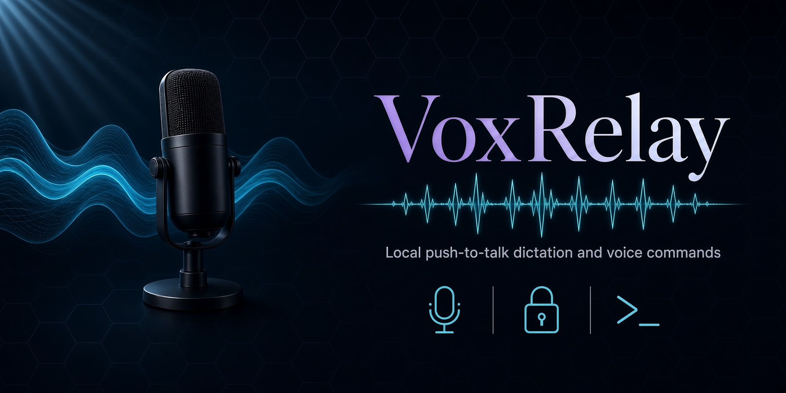
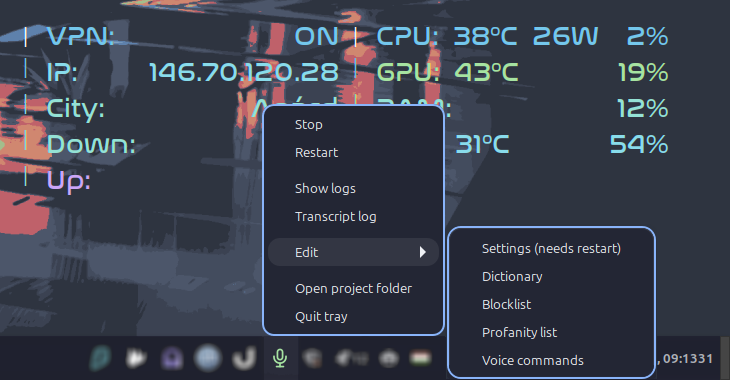
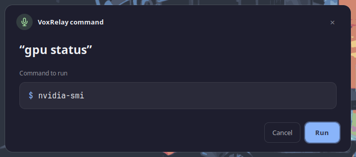

<p align="center">
  
</p>

# VoxRelay

**Offline, privacy-first voice dictation and voice commands for Linux.**
Hold a key, speak, release it, and your words get typed straight into
the focused window.

[](LICENSE)

-lightgrey)

VoxRelay is built on [faster-whisper](https://github.com/SYSTRAN/faster-whisper)
running entirely on your own hardware. A second, separate hotkey turns
spoken phrases into pre-approved shell commands, run only after you
confirm them in a popup, making it a hands-free way to drive a
terminal as well as a text editor.

> **Read this first: VoxRelay needs an X11 session.**
> Typing into other windows relies on `xdotool` and `xclip`, and Wayland
> blocks that kind of cross-application input by design. Check what you
> are running with:
>
> ```bash
> echo $XDG_SESSION_TYPE
> ```
>
> If it prints `x11` you are good to go. If it prints `wayland`, VoxRelay
> will not be able to type anything yet, so either switch your session to
> X11 at the login screen (where your desktop still offers it) or wait for
> Wayland support. See [Known limitations](#known-limitations).

## Why VoxRelay

Most voice typing tools (Wispr Flow, Otter, Dragon, Windows/macOS
built-in dictation) send your audio to a server somewhere. VoxRelay
never does, everything, from the speech-to-text model to the voice
command execution, runs locally:

- **100% offline** once the model is downloaded, no network calls,
  no telemetry
- **Push-to-talk voice typing** into any focused window, not just a
  browser extension or a single app
- **Voice-driven shell commands**, say a phrase, review the exact
  command in a confirmation dialog, approve or cancel
- **Runs on CPU or GPU**, an Nvidia card speeds things up but isn't
  required
- **Open source, MIT licensed**, read every line it runs

## Features

- Push-to-talk dictation, typed directly into the focused window
- A separate voice-command button: say a phrase, get a confirmation
  dialog showing the exact shell command, approve or cancel
- Unknown phrases can be taught a new command on the spot
- Approved commands run in a single, reusable terminal window with
  live output and a log file
- A custom dictionary to bias transcription toward names, project
  words or jargon it would otherwise mishear
- A blocklist to drop hallucinated sentences, and a profanity filter
  that censors individual words instead of dropping the whole sentence,
  replacing each with `censor_text` from the config
- Runs fully offline once the model is downloaded

## Requirements

- Linux with X11 (uses `xdotool`/`xclip`, which don't work on Wayland)
- Python 3.11+
- System packages: `xdotool`, `xclip`, `pulseaudio-utils` (for
  `paplay`), `fontconfig`, `python3-gi` + `gir1.2-gtk-3.0` (for the
  confirmation dialog), `gir1.2-ayatanaappindicator3-0.1` (for the tray
  icon), and a terminal emulator (`gnome-terminal`, `alacritty`, or
  anything providing `x-terminal-emulator`)
- Your user needs to be in the `input` group to read the keyboard
- An Nvidia GPU is optional; without one, transcription runs on CPU
  (slower, but works)

## Setup

```bash
git clone https://github.com/bandibandi/VoxRelay.git
cd VoxRelay
./setup.sh                        # copies config files, checks dependencies

# Recent Debian and Ubuntu based distros refuse pip installs into the system
# interpreter, so keep the dependencies in a virtualenv of their own.
python3 -m venv ~/.local/share/voxrelay/venv
~/.local/share/voxrelay/venv/bin/pip install -r requirements.txt

~/.local/share/voxrelay/venv/bin/python voxrelay.py
```

On an Nvidia GPU, add the CUDA libraries to that same virtualenv:

```bash
~/.local/share/voxrelay/venv/bin/pip install nvidia-cublas-cu12 nvidia-cudnn-cu12
```

`setup.sh` copies the `.example` config files into place (they're
gitignored so your personal edits never get committed) and reports
any missing system tool. It does not install system packages for you,
follow the hints it prints (usually `sudo apt install ...`).

The confirmation popup is deliberately left out of the virtualenv: it needs
the distro's GTK bindings (`python3-gi`), which a virtualenv does not carry,
so VoxRelay runs it under `/usr/bin/python3`. If your system interpreter
lives elsewhere, point `dialog_python` in `config/config.toml` at it.

After that, open `config/config.toml` and set at least:

- `keyboard_name` and `key`: run the command printed inside the file's
  comments to find your keyboard's exact evdev name, and pick which
  key triggers dictation
- `device` / `compute_type`: `"cuda"` / `"float16"` if you have a
  working Nvidia GPU setup, otherwise leave the defaults (`"cpu"` /
  `"int8"`)

## Autostart

To have VoxRelay run in the background and start itself when you log in,
install the systemd user service shipped with the repository:

```bash
mkdir -p ~/.config/systemd/user
sed -e "s|/path/to/VoxRelay|$PWD|g" \
    -e "s|/path/to/venv|$HOME/.local/share/voxrelay/venv|g" \
    voxrelay.service.example > ~/.config/systemd/user/voxrelay.service
systemctl --user daemon-reload
systemctl --user enable --now voxrelay.service
```

Useful afterwards:

```bash
journalctl --user -u voxrelay -f           # watch what it is doing
systemctl --user restart voxrelay          # reload settings that need a restart
systemctl --user disable --now voxrelay    # turn autostart off again
```

Two things in that unit file are worth knowing about, because leaving either
out works on some desktops and silently breaks on others:

- It is a **user** service, not a system one. VoxRelay needs a graphical
  session to type into, so starting it at boot would be too early.
- It sets `DISPLAY` and `XAUTHORITY` explicitly. Several desktops, Cinnamon
  among them, never activate `graphical-session.target` and never export
  those variables into the systemd user session.

If something else is using the GPU when VoxRelay starts, loading the model
fails and systemd retries every 30 seconds until the GPU frees up. Running a
game and dictating at the same time will not work on a single card unless you
switch to a smaller model or to CPU.

## Tray icon

`tray.py` puts a microphone icon in the system tray. The icon itself shows
whether dictation is running, and its menu can stop and start it, follow the
log, and open the voice command file for editing.

It is a second, separate service, and that is the point: the tray is what you
use to stop and start the daemon, so it has to stay up while the daemon is
down.



```bash
sed "s|/path/to/VoxRelay|$PWD|g" \
    voxrelay-tray.service.example > ~/.config/systemd/user/voxrelay-tray.service
systemctl --user daemon-reload
systemctl --user enable --now voxrelay-tray.service
```

Note that `ExecStart` there uses `/usr/bin/python3`, not the VoxRelay venv.
`tray.py` needs the distro's GTK bindings and the Ayatana AppIndicator
typelib, which a virtualenv does not have, for the same reason `dialog.py` is
launched with the system interpreter.

The menu items are:

- **Start** / **Stop**, whichever applies. The label and the icon follow the
  real state of the service, so they also change when you start or stop it
  from a terminal.
- **Restart**, for settings that only take effect on a restart.
- **Show logs**, a terminal following `journalctl --user -u voxrelay`, with a
  rule drawn before each recording. The journal is persistent, so this is the
  whole history, not only the current run.
- **Transcript log**, which opens `transcript_log.txt`, everything dictated so
  far with timestamps.
- **Edit**, a submenu for the settings and the word lists: `config.toml`,
  `dictionary.txt`, `blocklist.txt`, `profanity.txt` and `commands.toml`. Only
  the settings entry is labelled as needing a restart, because the daemon
  watches the other four and reloads them on its own when they change.
- **Open project folder**, in your file manager.
- **Quit tray**, which closes the icon only and leaves dictation running.

If the icon never appears, the usual cause is a panel without AppIndicator
support. Cinnamon and KDE handle these natively; GNOME needs the AppIndicator
extension.

## Voice commands



Edit `config/commands.toml` to map spoken phrases to shell commands,
or just say a phrase that isn't in there yet, the dialog will ask you
what it should run and save it for next time. Matching ignores case,
accents, punctuation and spacing, so "Docker list." and "docker list"
are the same phrase.

## Project layout

- `voxrelay.py`: the daemon (dictation + voice commands)
- `dialog.py`: the confirmation/entry popup for voice commands
- `tray.py`: the tray icon and its menu, see Tray icon
- `runner.sh`: runs approved commands inside the persistent terminal
- `voxrelay.service.example`: systemd user service template, see Autostart
- `voxrelay-tray.service.example`: systemd user service template for the
  tray icon
- `config/`: your personal settings and word lists (gitignored) plus
  `.example` templates (committed)

## Known limitations

- **X11 only, no Wayland support yet.** This rules out desktops that have
  moved to Wayland only, GNOME 50 among them. Porting it means swapping
  `xdotool` for `ydotool` (which injects at kernel level through
  `uinput`, so it works regardless of compositor) and `xclip` for
  `wl-clipboard`. The clipboard path is the one to use there, because
  `ydotool` types through a US layout and mangles accented characters.
  Raising the command terminal to the front has no Wayland equivalent at
  all, since compositors deliberately forbid it, so that part would
  simply be dropped.
- The profanity filter only matches single words, not multi-word
  phrases
- No automated way yet to discover `keyboard_name`/`key` beyond the
  manual evdev snippet in `config.toml.example`

## License

MIT, see [LICENSE](LICENSE).

---

Built by [andrashorvath.dev](https://andrashorvath.dev).
